# 注册中心实现(Etcd)

## 什么是注册中心？

注册中心(Service Registry)是 RPC 框架中非常重要的一个组件,它的主要作用包括以下几点:

1. **服务注册**
    - 服务提供者在启动时,会将自己的服务信息(如服务名、地址、端口等)注册到注册中心。
    - 注册中心负责维护这些服务的注册信息,为服务消费者提供查询。

2. **服务发现**
    - 服务消费者在需要调用服务时,会查询注册中心获取可用的服务提供者信息。
    - 注册中心根据负载均衡策略选择合适的服务实例,返回给消费者。

3. **服务状态管理**
    - 注册中心会定期检查服务实例的健康状态,并及时更新注册信息。
    - 当某个服务实例下线或者故障时,注册中心会将其从服务列表中剔除。

4. **服务治理**
    - 注册中心可以提供服务分组、服务版本管理等功能,支持更细粒度的服务治理。
    - 通过注册中心,可以实现服务的权重调整、灰度发布等高级特性。

用一张图来表示在本RPC项目中注册中心的作用,服务提供者把服务的信息放到注册中心中，消费者去注册中心服务发现，获取要调用的服务，然后再向服务提供者发起调用：


### 注册中心有哪些？

1. **Zookeeper**: 分布式协调服务,广泛应用于 Dubbo、Kafka 等 RPC 框架中。
2. **Consul**: HashiCorp 公司开源的服务网格解决方案,集成了注册中心、服务发现等功能。
3. **Eureka**: Netflix 开源的服务注册中心,曾广泛应用于 Spring Cloud 生态。
4. **etcd**: CoreOS 公司开源的分布式键值存储,也可用作注册中心。
5. **Nacos**: Alibaba 开源的应用管理与服务治理平台,集成了注册中心、配置管理等功能。

注册中心作为 RPC 框架的核心组件,它的可靠性和性能对整个分布式系统的可用性都有重要影响。

## 注册中心设计

我们的注册中心需要实现几个关键的能力：

1. **服务注册和发现**
    - 服务提供者在启动时将自身信息**注册**到注册中心。
    - 服务消费者通过注册中心**查找并调用**可用的服务提供者。
    - 注册中心需要提供高效的查询和路由机制,确保服务发现的性能。

2. **服务健康检查**
    - 注册中心需要定期检查服务实例的健康状态,及时**剔除下线**或故障的服务。
    - 健康检查可以通过**心跳机制、TCP 连接检测**等方式实现。
    - 注册中心需要处理服务实例的上下线事件,并通知相关的服务消费者。

3. **负载均衡策略**
    - 当存在多个可用的服务提供者时,注册中心需要根据负载均衡策略选择合适的实例。
    - 常见的负载均衡策略包括随机、轮询、加权轮询、最小活跃连接数等。
    - 注册中心需要根据服务实例的负载情况动态调整负载均衡策略。

4. **服务元数据管理**
    - 注册中心需要**存储服务提供者的详细元数据信息,如服务名称、版本、实例地址**等。
    - 这些元数据信息可以帮助服务消费者做更精细的服务选择和调用。
    - 注册中心需要提供元数据的增删改查等管理功能。

5. **服务治理能力**
    - 注册中心可以提供服务分组、服务权重、路由规则等高级服务治理功能。
    - 这些功能可以帮助开发者实现更细粒度的服务管控,如灰度发布、流量控制等。
    - 注册中心需要设计可扩展的架构,支持服务治理功能的灵活配置和动态调整。

6. **高可用和容错**
    - 注册中心自身需要具备高可用性,避免单点故障。
    - 可以采用主备复制、分布式部署等方式来提高可用性。
    - 注册中心还需要考虑服务发现的容错性,在注册中心宕机时仍能保证服务调用。

7. **性能和扩展性**
    - 注册中心需要支撑大规模的服务注册和发现,具备良好的性能表现。
    - 可以采用分片、缓存、异步等手段来提高注册中心的吞吐量和响应速度。
    - 注册中心的架构还需要具备良好的扩展性,以应对不断增长的服务规模。

用一张图来表示注册中心要实现的功能





一些功能如 负载均衡我们已经在RPC层实现过了，注册中心可以暂时不实现，主要实现几个核心的：

+ 服务注册、服务发现、服务剔除、心跳检测、数据存储

## 技术选型Etcd

对于注册中心的技术选型，我们需要考虑它的性能，高可用性，高可靠性，稳定性，数据一致性等内容。

高可靠和高可用非要重要，如果注册中心都挂了，那么会影响到所有服务调用。

在本章节中，我们实现Etcd作为注册中心。https://etcd.io/

### Etcd介绍 

etcd（读作 et-see-dee）是一种开源的分布式统一键值存储，用于分布式系统或计算机集群的共享配置、服务发现和的调度协调。etcd 有助于促进更加安全的自动更新，协调向主机调度的工作，并帮助设置容器的覆盖网络。

etcd 是许多其他项目的核心组件。最值得注意的是，它是 **Kubernetes** 的首要数据存储，也是容器编排的实际标准系统。使用 etcd， 云原生应用可以保持更为一致的运行时间，而且在个别服务器发生故障时也能正常工作。应用从 etcd 读取数据并写入到其中；通过分散配置数据，为节点配置提供冗余和弹性。

### 服务元信息设计

ServiceMetaInfo是注册中心中服务的元数据信息,包含服务名称、版本、地址、权重等关键属性,为服务注册、发现等功能提供了基础数据模型。

```java
/**
 * 服务元信息 （注册信息）
 */
@Data
public class ServiceMetaInfo {
    /**
     * 服务名称
     */
    private String serviceName;

    /**
     * 服务版本号
     */
    private String serviceVersion = "1.0";

    /**
     * 服务地址
     */
    private String serviceAddress;

    /**
     * 服务分组（暂未实现）
     */
    private String serviceGroup = "default";
    private String serviceHost;
    private Integer servicePort;

    /**
     * 服务权重
     */
    private int weight = 1;

    /**
     * 获取服务键名
     */
    public String getServiceKey() {
        return String.format("%s:%s", serviceName, serviceVersion);
    }

    /**
     * 获取服务节点键名
     */
    public String getServiceNodeKey() {
        return String.format("%s/%s:%s", getServiceKey(), serviceHost,servicePort);
    }

    /**
     * 获取完整的服务地址
     */
    public String getServiceAddress() {
        if (!StrUtil.contains(serviceHost, "http")) {
            return String.format("http://%s:%s", serviceHost, servicePort);
        }
        return String.format("%s:%s", serviceHost, servicePort);
    }
}
```

### 注册中心配置

注册中心配置主要包括：注册中心类别、地址、用户名、密码、超时时间。

```java
package com.yunfei.rpc.config;

import com.yunfei.rpc.registry.RegistryKeys;
import lombok.Data;

/**
 * RPC注册中心配置
 */
@Data
public class RegistryConfig {
    /**
     * 注册中心类别
     */
    private String registry = RegistryKeys.ETCD;

    /**
     * 注册中心地址
     */
    private String address = "http://localhost:2380";

    /**
     * 用户名
     */
    private String username;

    /**
     * 密码
     */
    private String password;

    /**
     * 超时时间 ms
     */
    private Long timeout = 10000L;
}
```

### 注册中心接口

我们可能会有多个注册中心，它和我们的序列化器一样，都应该可以支持使用Java的SPI机制进行动态加载，例如注册中心我们可以在配置文件中设置，可以选用Zookeeper、Redis、Nacos等等。

接口主要提供：初始化、服务注册、服务发现 、注销服务、心跳检测、节点监听功能。

```java
/**
 * 注册中心接口
 */
public interface Registry {

    /**
     * 初始化
     *
     * @param registryConfig
     */
    void init(RegistryConfig registryConfig);

    /**
     * 注册服务 服务端
     *
     * @param serviceMetaInfo
     * @throws Exception
     */
    void register(ServiceMetaInfo serviceMetaInfo) throws Exception;

    /**
     * 取消注册服务 服务端
     *
     * @param serviceMetaInfo
     */
    void unRegister(ServiceMetaInfo serviceMetaInfo);

    /**
     * 服务发现  获取某服务的所有节点  客户端 消费端
     *
     * @param serviceKey
     * @return
     */
    List<ServiceMetaInfo> serviceDiscovery(String serviceKey);

    /**
     * 服务销毁
     */
    void destroy();

    /**
     * 心跳检测
     */
    void heartbeat();

    /**
     * 监听服务节点
     */
    void watch(String serviceNodeKey);
}
```

### Etcd注册中心实现

#### 全局变量

```java
    private Client client;
    private KV kvClient;
    /**
     * 根节点
     */
    private static final String ETCD_ROOT_PATH = "/rpc/";
    /**
     * 本地注册节点 key 集合 用于维护续期
     */
    private final Set<String> localRegisterNodeKeySet = new HashSet<>();
    /**
     * 注册中心缓存
     */
    private final RegistryServiceCache registryServiceCache = new RegistryServiceCache();
    /**
     * 监听的key集合
     */
    private final Set<String> watchingKeySet = new ConcurrentHashSet<>();
```

#### 初始化

初始化主要是为了创建Etcd的client和KVClient对象

```java
@Override
public void init(RegistryConfig registryConfig) {
    client = Client.builder().endpoints(registryConfig.getAddress())
        .connectTimeout(Duration.ofMillis(registryConfig.getTimeout())).build();
    kvClient = client.getKVClient();
    heartbeat();
}
```


#### 服务注册

服务注册主要就是把键值对保存到Etcd中：

+ 键是：ETCD_ROOT_PATH + serviceMetaInfo.getServiceNodeKey() 相当于一个唯一标识
+ 值是：服务的元信息serviceMetaInfo

同时我们需要设置过期时间30s，用于剔除过期节点、心跳检测。这样如果服务提供者宕机了，也可以超时自动移除

```java
@Override
public void register(ServiceMetaInfo serviceMetaInfo) throws Exception {
    // 创建Lease 和KV客户端
    Lease leaseClient = client.getLeaseClient();

    // 创建租约 30s
    long leaseId = leaseClient.grant(30).get().getID();

    // 设置要存储的键值对
    String registerKey = ETCD_ROOT_PATH + serviceMetaInfo.getServiceNodeKey();
    ByteSequence key = ByteSequence.from(registerKey, StandardCharsets.UTF_8);
    ByteSequence value = ByteSequence.from(JSONUtil.toJsonStr(serviceMetaInfo), StandardCharsets.UTF_8);

    // 将键值对与租约绑定 并设置过期时间
    PutOption putOption = PutOption.builder().withLeaseId(leaseId).build();
    kvClient.put(key, value, putOption).get();
    localRegisterNodeKeySet.add(registerKey);
}
```

#### 服务取消注册

即从Etcd中删除对应的服务节点信息，本地集合 也要删。

```java
@Override
public void unRegister(ServiceMetaInfo serviceMetaInfo) {
    String registerKey = ETCD_ROOT_PATH + serviceMetaInfo.getServiceNodeKey();
    kvClient.delete(ByteSequence.from(registerKey, StandardCharsets.UTF_8));
    localRegisterNodeKeySet.remove(registerKey);
}
```

#### 服务发现

我们有一个本地缓存数组serviceCache:它的实现很简单：

```java
public class RegistryServiceCache {
    /**
     * 服务缓存
     */
    List<ServiceMetaInfo> serviceCache;
    /**
     * 写缓存
     */
    void writeCache(List<ServiceMetaInfo> newServiceCache) {
        serviceCache = newServiceCache;
    }
    /**
     * 读缓存
     */
    List<ServiceMetaInfo> readCache() {
        return serviceCache;
    }
    /**
     * 清空缓存
     */
    void clearCache() {
        serviceCache = null;
    }
}
```

如果缓存中有，那么直接获取，就不用从Etcd中获取了

如果没有的话，那么就去搜索，根据前缀搜索，拿到结果之后再把服务进行解析为`List<ServiceMetaInfo>`的样子

最后还可以 写入缓存中

```java
@Override
public List<ServiceMetaInfo> serviceDiscovery(String serviceKey) {
    // 优先从缓存中获取
    List<ServiceMetaInfo> serviceMetaInfoList = registryServiceCache.readCache();
    if (CollUtil.isNotEmpty(serviceMetaInfoList)) {
        return serviceMetaInfoList;
    }
    // 前缀搜索，结尾一定要加 '/'
    String searchPrefix = ETCD_ROOT_PATH + serviceKey + "/";
    GetOption getOption = GetOption.builder().isPrefix(true).build();
    try {
        List<KeyValue> keyValues = kvClient.get(ByteSequence.from(searchPrefix, StandardCharsets.UTF_8), getOption).get().getKvs();
        // 解析服务
        List<ServiceMetaInfo> serviceMetaInfos = keyValues.stream().map(keyValue -> {
            String key = keyValue.getValue().toString(StandardCharsets.UTF_8);
            // 监听key的变化
            watch(key);
            return JSONUtil.toBean(key, ServiceMetaInfo.class);
        }).collect(Collectors.toList());
        // 写入缓存
        registryServiceCache.writeCache(serviceMetaInfos);
        return serviceMetaInfos;
    } catch (Exception e) {
        throw new RuntimeException("服务发现失败", e);
    }
}
```

#### 服务销毁

当服务提供者关闭的时候，我们需要关闭所有注册的服务，同时也要删除本地即集合。

```java
@Override
public void destroy() {
    System.out.println("当前节点下线");

    // 下线时，删除所有注册的服务
    for (String key : localRegisterNodeKeySet) {
        try {
            kvClient.delete(ByteSequence.from(key, StandardCharsets.UTF_8)).get();
        } catch (Exception e) {
            throw new RuntimeException(key + "下线失败", e);
        }
    }

    // 关闭客户端
    if (client != null) {
        client.close();
    }

    if (kvClient != null) {
        kvClient.close();
    }

}
```

服务下线分为：

+ 被动下线：Etcd过期机制删除
+ 主动下线：提供者主动从注册中心删除

如何在Java项目退出的时候，执行操作呢？我们可以 利用JVM的ShutDownHook来实现

```java
@Slf4j
public class RpcApplication {
    private static volatile RpcConfig rpcConfig;

    public static void init(RpcConfig newRpcConfig) {
        rpcConfig = newRpcConfig;
        log.info("rpc application init success,config:{}", rpcConfig);
        // // 注册中心初始化
        RegistryConfig registryConfig = rpcConfig.getRegistryConfig();
        Registry registry = RegistryFactory.getInstance(registryConfig.getRegistry());
        registry.init(registryConfig);
        log.info("registry init success,config:{}", registryConfig);

        // 创建并 注册Shutdown Hook ,JVM 退出时执行擦欧总
        Runtime.getRuntime().addShutdownHook(new Thread(registry::destroy));
    }
    
	 ...   
}
```


#### 心跳检测

我们向Etcd定期发送心跳信号来检测目标是否存活，如果系统在一定时间内没有响应，那么就 认为目标系统故障或者不可用了。

Etcd实现心跳检测比较简单，因为Etcd自带了key过期的机制。我们给节点注册的时候加上了过期时间，再让节点定期去续期，重置过期时间，如果节点宕机了，一直不去续期，那么Etcd会自动删除过期key。

因此我们的心跳检测只需要去定期的续约即可。

我们怎么知道服务提供者要去维护哪些节点呢？

只需要在本地维护一个注册节点信息集合，注册的时候把Key加入到集合中，每次维护集合的信息。

```java
@Override
public void heartbeat() {
    // 100s续约一次
    CronUtil.schedule("*/10 * * * * *", new Task() {
        @Override
        public void execute() {
            for (String key : localRegisterNodeKeySet) {
                try {
                    List<KeyValue> keyValues = kvClient.get(ByteSequence.from(key, StandardCharsets.UTF_8)).get().getKvs();
                    // 节点已经过期了，需要重启节点才能重新注册
                    if (CollUtil.isEmpty(keyValues)) {
                        continue;
                    }
                    // 节点没有过期，重新 注册 相当于续约
                    KeyValue keyValue = keyValues.get(0);
                    String value = keyValue.getValue().toString(StandardCharsets.UTF_8);
                    ServiceMetaInfo serviceMetaInfo = JSONUtil.toBean(value, ServiceMetaInfo.class);
                    register(serviceMetaInfo);
                } catch (Exception e) {
                    throw new RuntimeException(key + "续约失败", e);
                }
            }
        }
    });

    // 支持秒级别定时任务
    CronUtil.setMatchSecond(true);
    CronUtil.start();
}
```

#### 服务监听

如果服务注册信息发生了变化，那么我们需要更新消费端缓存



```java
@Override
public void watch(String serviceNodeKey) {
    Watch watchClient = client.getWatchClient();
    // 之间未被监听，添加监听
    boolean newWatch = watchingKeySet.add(serviceNodeKey);
    if (newWatch) {
        watchClient.watch(ByteSequence.from(serviceNodeKey, StandardCharsets.UTF_8), (response) -> {
            for (WatchEvent event : response.getEvents()) {

                switch (event.getEventType()) {
                    case DELETE:
                        registryServiceCache.clearCache();
                        break;
                    case PUT:
                    default:
                        break;
                }
            }
        });
    }

}
```
