# 全局配置加载

## 为什么要全局配置加载？

在开发 RPC 框架时需要引入全局配置加载的功能主要有以下几个原因:

1. 配置信息繁多:
   - RPC 框架需要涉及很多配置信息,如注册中心地址、序列化方式、网络服务端口号等。
   - 如果直接在代码中硬编码这些配置,不利于后期维护和扩展。

2. 支持自定义配置:
   - RPC 框架需要被其他项目引入使用,作为服务提供者或消费者。
   - 引入框架的项目应该能够通过配置文件自定义 RPC 框架的配置,而不是强制使用框架中的硬编码配置。

3. 统一配置管理:
   - 服务提供者和服务消费者需要使用相同的 RPC 框架配置,以保证网络通信的一致性。
   - 因此需要一个统一的全局配置对象,方便框架内部各组件快速获取一致的配置信息。

4. 配置文件读取:
   - RPC 框架需要能够从配置文件中读取配置信息,并将其转换为Java对象。
   - 使用通用的配置读取工具(如Hutool)可以简化这个过程,提高代码复用性。


## 如何设计？

参考Dubbo的设计方案：https://cn.dubbo.apache.org/zh-cn/overview/mannual/java-sdk/reference-manual/config/overview/

在本RPC框架中，我们主要做了以下一些配置：

`RpcConfig` 类是 RPC 框架的全局配置类,它包含了 RPC 框架中很多重要的配置项。

1. **名称和版本**:
   - `name` 和 `version` 属性用于标识 RPC 框架的名称和版本号。这些信息可以在日志、监控等场景中使用。

2. **服务器配置**:
   - `serverHost` 和 `serverPort` 定义了 RPC 服务器的主机和端口信息。这是 RPC 服务提供者端的必要配置。

3. **模拟调用**:
   - `mock` 属性用于控制是否开启模拟调用模式,可在测试或者特殊场景下使用。

4. **序列化配置**:
   - `serializer` 属性指定了默认的序列化实现,可以选择 `SerializerKeys` 中定义的不同序列化方式,如 JDK、Kryo 等。

5. **注册中心配置**:
   - `registryConfig` 属性包含了服务注册中心的配置信息,如地址、凭证等。这是 RPC 的关键功能之一。

6. **负载均衡配置**:
   - `loadBalancer` 属性指定了默认的负载均衡策略,可以选择 `LoadBalancerKeys` 中定义的不同策略,如轮询、随机等。

7. **容错策略配置**:
   - `retryStrategy` 属性用于配置服务调用的重试策略,如 `RetryStrategyKeys` 中定义的不重试、有限重试等。
   - `tolerantStrategy` 属性用于配置服务调用的容错策略,如 `TolerantStrategyKeys` 中定义的快速失败、熔断等。

这个 `RpcConfig` 类将 RPC 框架中的各种重要配置项集中在一起,使得整个框架的配置管理更加集中和便捷。开发者可以根据具体需求,灵活地配置不同的序列化、负载均衡、容错等策略,从而满足不同应用场景的需求。

为了更直观表示我们整个系统的配置，我画了一张框架图：



上面这些只是Rpc的配置，除此之外，我们还需要一个RpcApplication 类来管理 RPC 框架的入口和全局配置管理器，我们希望在里面可以集中管理这些配置选项，并且可以轻松获取这些选项，例如

+ 初始化Rpc配置信息
+ 通过单例模式来获取上述的Rpc配置信息

## 代码实现

RpcConfig类代码如下：

```java
/**
 * RPC配置
 */
@Data
public class RpcConfig {

    /**
     * 名称
     */
    private String name = "yunfei-rpc";

    /**
     * 版本号
     */
    private String version = "1.0";

    /**
     * 服务器主机
     */
    private String serverHost = "localhost";

    /**
     * 服务器端口
     */
    private int serverPort = 8080;

    /**
     * 模拟调用
     */
    private boolean mock = false;

    /**
     * 序列化器
     */
    private String serializer = SerializerKeys.JDK;

    /**
     * 注册中心配置
     */
    private RegistryConfig registryConfig = new RegistryConfig();

    /**
     * 负载均衡器
     */
    private String loadBalancer = LoadBalancerKeys.ROUND_ROBIN;

    /**
     * 重试策略
     */
    private String retryStrategy = RetryStrategyKeys.NO;

    /**
     * 容错策略
     */
    private String tolerantStrategy = TolerantStrategyKeys.FAIL_FAST;
}
```

RpcApplication类：

```java

/**
 * RPC应用
 * 相当于holder ,存放了项目全局用到的变量，双检锁实现单例
 */
@Slf4j
public class RpcApplication {
    private static volatile RpcConfig rpcConfig;

    public static void init(RpcConfig newRpcConfig) {
        rpcConfig = newRpcConfig;
        log.info("rpc application init success,config:{}", rpcConfig);
        // // 注册中心初始化
        RegistryConfig registryConfig = rpcConfig.getRegistryConfig();
        Registry registry = RegistryFactory.getInstance(registryConfig.getRegistry());
        registry.init(registryConfig);
        log.info("registry init success,config:{}", registryConfig);

        // 创建并 注册Shutdown Hook ,JVM 退出时执行擦欧总
        Runtime.getRuntime().addShutdownHook(new Thread(registry::destroy));
    }

    /**
     * 初始化
     */
    public static void init() {
        RpcConfig newRpcConfig;
        try {
            newRpcConfig = ConfigUtils.loadConfig(RpcConfig.class, RpcConstant.DEFAULT_CONFIG_PREFIX);
        } catch (Exception e) {
            // 读取配置文件失败，使用默认配置
            log.error("load config error,use default config", e);
            newRpcConfig = new RpcConfig();
        }
        init(newRpcConfig);
    }

    /**
     * 获取配置
     */
    public static RpcConfig getRpcConfig() {
        if (rpcConfig == null) {
            synchronized (RpcApplication.class) {
                if (rpcConfig == null) {
                    init();
                }
            }
        }
        return rpcConfig;
    }

}
```

代码解释：

1. **单例模式实现**:
   - `rpcConfig` 是一个静态的 `volatile` 变量,用于存储全局的 `RpcConfig` 配置对象。
   - `getRpcConfig()` 方法使用了双重检查锁的单例模式实现,确保 `rpcConfig` 对象的唯一性。
2. **初始化方法**:
   - `init(RpcConfig newRpcConfig)` 方法用于初始化 RPC 应用,接受一个 `RpcConfig` 对象作为参数。
   - 然后根据 `registryConfig` 创建并初始化注册中心实例。
   - 最后注册一个 JVM 关闭钩子,在 JVM 退出时自动销毁注册中心实例。
3. **自动初始化**:
   - `init()` 方法用于自动初始化 RPC 应用。
   - 首先尝试使用 `ConfigUtils.loadConfig()` 方法从默认的配置文件路径加载 `RpcConfig` 对象。
   - 如果加载失败,则创建一个默认的 `RpcConfig` 对象。

这个 `RpcApplication` 类是整个 RPC 框架的核心入口点。它负责管理全局的 `RpcConfig` 配置对象,同时还负责初始化注册中心实例并确保其生命周期与 JVM 保持一致。这种设计模式能够确保整个 RPC 框架的配置管理和初始化过程是统一和可靠的。

我们再来看看如何从配置文件中读取信息：

```java
 newRpcConfig = ConfigUtils.loadConfig(RpcConfig.class, RpcConstant.DEFAULT_CONFIG_PREFIX);
```

对于propertities文件的读取比较 简单，可以直接使用Hutool工具类实现：

```java
public static <T> T loadConfig(Class<T> tClass, String prefix, String environment) {
    StringBuilder configFileBuilder = new StringBuilder("application");
    if (StrUtil.isNotBlank(environment)) {
        configFileBuilder.append("-").append(environment);
    }
    configFileBuilder.append(".properties");
    Props props = new Props(configFileBuilder.toString());
    return props.toBean(tClass, prefix);
}
```


读取yml文件需要引入依赖：

```xml
        <dependency>
            <groupId>org.yaml</groupId>
            <artifactId>snakeyaml</artifactId>
            <version>1.29</version>
        </dependency>
```

读取配置文件的完整代码如下：

参考：[github](https://github.com/liyupi/yu-rpc/blob/b5e9d7bd992c07fcac54807d91ca16bf80abf5f9/yu-rpc-core/src/main/java/com/yupi/yurpc/utils/ConfigUtils.java)

```java
package com.yunfei.rpc.utils;

import cn.hutool.core.io.resource.NoResourceException;
import cn.hutool.core.util.StrUtil;
import cn.hutool.json.JSONObject;
import cn.hutool.json.JSONUtil;
import cn.hutool.setting.dialect.Props;
import cn.hutool.setting.yaml.YamlUtil;

import java.util.Map;

import lombok.extern.slf4j.Slf4j;

/**
 * 配置工具类
 * 加载配置文件规则：
 * <p>conf/application.properties >
 * application.properties >
 * conf/application.yaml >
 * application.yaml >
 * conf/application.yml >
 * application.yml</p>
 */
@Slf4j
public class ConfigUtils {

    private static final String BASE_PATH_DIR = "conf/";
    private static final String BASE_CONF_FILE_NAME = "application";
    private static final String PROPERTIES_FILE_EXT = ".properties";
    private static final String YAML_FILE_EXT = ".yaml";
    private static final String YML_FILE_EXT = ".yml";
    private static final String ENV_SPLIT = "-";

    /**
     * 加载配置
     *
     * @param clazz  clazz
     * @param prefix properties common prefix
     * @param <T>    T
     * @return props
     */
    public static <T> T loadConfig(Class<T> clazz, String prefix) {
        return loadConfig(clazz, prefix, "");
    }

    /**
     * 加载配置
     * <p>
     * 优先加载 properties, 找不到再加载 yaml / yml
     *
     * @param clazz  clazz
     * @param prefix properties common prefix
     * @param env    environment
     * @param <T>    T
     * @return props
     */
    public static <T> T loadConfig(Class<T> clazz, String prefix, String env) {
        T props;
        return (props = loadProperties(clazz, prefix, env)) != null ? props : loadYaml(clazz, prefix, env);
    }

    /**
     * 加载 properties 配置 application-{env}.properties
     * <p>
     * 优先加载 conf/conf.properties, 找不到再加载 conf.properties
     *
     * @param clazz  clazz
     * @param prefix properties common prefix
     * @param env    environment
     * @param <T>    T
     * @return props
     */
    public static <T> T loadProperties(Class<T> clazz, String prefix, String env) {
        try {
            return doLoadProperties(clazz, BASE_PATH_DIR + BASE_CONF_FILE_NAME, prefix, env);
        } catch (NoResourceException e) {
            log.warn(
                    "Not exists properties conf file in [{}], will load properties file from classpath",
                    BASE_PATH_DIR);
        }
        try {
            return doLoadProperties(clazz, BASE_CONF_FILE_NAME, prefix, env);
        } catch (NoResourceException e) {
            log.warn("Not exists properties conf file,  will load yaml/yml file from classpath");
        }
        return null;
    }

    /**
     * 加载 yaml 配置 application-{env}.yaml / application-{env}.yml
     * <p>
     * 优先加载 conf/conf.yaml, 找不到再加载 conf.yaml，其次加载 conf/conf.yml, 找不到再加载 conf.yml
     *
     * @param clazz  clazz
     * @param prefix properties common prefix
     * @param env    environment
     * @param <T>    T
     * @return props
     */
    public static <T> T loadYaml(Class<T> clazz, String prefix, String env) {
        // 读取 yaml 文件，优先读取 conf/application-{env}.yaml
        try {
            return doLoadYaml(clazz, BASE_PATH_DIR + BASE_CONF_FILE_NAME, prefix, env,
                    YAML_FILE_EXT);
        } catch (NoResourceException e) {
            log.warn("Not exists yaml conf file in [{}], will load yaml file from classpath",
                    BASE_PATH_DIR);
        }
        // 加载 application-{env}.yaml 文件
        try {
            return doLoadYaml(clazz, BASE_CONF_FILE_NAME, prefix, env,
                    YAML_FILE_EXT);
        } catch (NoResourceException e) {
            log.warn("Not exists yaml conf file in [{}], will load yml file", BASE_PATH_DIR);
        }
        // 读取 yml 文件，优先读取 conf/application-{env}.yml
        try {
            return doLoadYaml(clazz, BASE_PATH_DIR + BASE_CONF_FILE_NAME, prefix, env,
                    YML_FILE_EXT);
        } catch (NoResourceException e) {
            log.warn("Not exists yml conf file in [{}], will load yml file from classpath",
                    BASE_PATH_DIR);
        }
        // 加载 application-{env}.yml 文件
        try {
            return doLoadYaml(clazz, BASE_CONF_FILE_NAME, prefix, env,
                    YML_FILE_EXT);
        } catch (NoResourceException e) {
            log.error("no conf file!");
            throw e;
        }
    }

    /**
     * 加载 properties 配置 application-{env}.properties
     *
     * @param clazz  clazz
     * @param base   base path
     * @param prefix properties common prefix
     * @param env    environment
     * @param <T>    T
     * @return props
     */
    public static <T> T doLoadProperties(Class<T> clazz, String base, String prefix, String env)
            throws NoResourceException {
        String confFilePath = buildConfigFilePath(base, env, PROPERTIES_FILE_EXT);
        Props props = new Props(confFilePath);
        return props.toBean(clazz, prefix);
    }

    /**
     * 加载 yaml 配置 application-{ev}.yaml / application-{env}.yml
     *
     * @param clazz  clazz
     * @param base   base path
     * @param prefix properties common prefix
     * @param env    environment
     * @param ext    file extension
     * @param <T>    T
     * @return props
     */
    public static <T> T doLoadYaml(Class<T> clazz, String base, String prefix, String env,
                                   String ext) throws NoResourceException {
        String confFilePath = buildConfigFilePath(base, env, ext);
        Map<String, Object> props = YamlUtil.loadByPath(confFilePath);
        JSONObject rpcConfigProps = JSONUtil.parseObj(props).getJSONObject(prefix);
        return JSONUtil.toBean(rpcConfigProps, clazz);
    }

    /**
     * 构建配置文件路径
     *
     * @param base base path
     * @param env  environment
     * @param ext  file extension
     * @return config file path
     */
    private static String buildConfigFilePath(String base, String env, String ext) {
        StringBuilder configFileBuilder = new StringBuilder(base);
        if (StrUtil.isNotBlank(env)) {
            configFileBuilder.append(ENV_SPLIT).append(env);
        }
        configFileBuilder.append(ext);
        return configFileBuilder.toString();
    }
}
```

测试：

```java
@Test
void loadYaml() {
    RpcConfig rpcConfig = ConfigUtils.loadYaml(RpcConfig.class, "rpc", "");
    System.out.println(rpcConfig);
}
```

运行结果：


