# 序列化器实现

## 我们为什么要实现序列化？

这是因为：网络传输的数据须是二进制数据，但调用方请求的出入参数都是对象：

+ 序列化：对象不能直接在网络传输，需提前转成可传输的二进制，且要求可逆，即“序列化”将对象转换成二进制数据
+ 反序列化：服务提供方就能正确从二进制数据中分割出不同请求，同时根据请求类型和序列化类型，把二进制的消息体逆向还原成请求对象，即“反序列化”将二进制转换为对象


整体的RPC框架如图：



以上两点便是我们这个RPC框架要实现序列化和反序列化的原因。

## 常见序列化器对比

Dubbo中对序列化器的介绍：https://cn.dubbo.apache.org/zh-cn/overview/mannual/java-sdk/reference-manual/serialization/
经调查，常见的序列化器对比情况如下：

JDK原生序列化：

+ 优点：使用方便，无需引入额外依赖。
+ 缺点：速度慢，占空间，有安全问题，已不再推荐使用。

> 为什么会有安全问题？  
> 答：只要服务端反序列化数据，客户端传递类的readObject中代码会自动执行，给予攻击者在服务器上运行代码的能力。

JSON：

+ 优点：跨语言，使用简单，格式可读，几乎所有编程语言都有JSON的解析和生成库。
+ 缺点：序列化结果大小较大，性能一般，可能存在反序列化漏洞。不能很好地处理复杂的数据结构和循环引用，可能导致性能下降或者序列化失败。

Kryo：

+ 优点：高性能，序列化后体积小，适合分布式。无需实现Serializable接口。
+ 缺点：不跨语言，只有Java。序列化格式复杂

Hessian：

+ 优点：二进制序列化，数据量哓，网络传输速度快。支持跨语言，适合分布式
+ 缺点：性能比JSON低，需要实现Serializable接口，有限制

Protobuf：

+ 优点：高性能，跨语言，序列化后体积小。跨语言。适合分布式。支持schema演化。
+ 缺点：使用不够友好，生成类可读性差，需要工具辅助。配置复杂，需要先定义数据结构消息格式

Avro:

+ 优点：高性能二进制序列化,支持动态类型,适合大数据场景。可以将序列化数据和Schema一起存储。
+ 缺点：对于习惯静态类型语言的工程师来说,JSON格式的IDL不够直观。

XML&SOAP:

+ 优点：可读性好,利于人工维护和调试。
+ 缺点：序列化后数据冗长,性能相对较差。SOAP使用较为复杂。

Thrift:

+ 优点：高性能、跨语言、跨平台支持。适合高性能分布式RPC场景。
+ 缺点：文档相对较少，服务器部署需要开放特定端口,不够灵活。序列化数据不可读,调试较困难。

做一张表总结：

| 序列化协议    | 简要介绍            | 优点                   | 缺点                                      |
|----------|-----------------|----------------------|-----------------------------------------|
| JDK原生序列化 | JVM原生序列化支持      | 使用方便,无需引入额外依赖        | 速度慢,占空间,有安全问题,已不再推荐使用                   |
| JSON     | 各种JSON库直接使用     | 跨语言,使用简单,格式可读        | 序列化结果大小较大,性能一般,可能存在反序列化漏洞               |
| Kryo     | Kryo框架          | 速度快,序列化后体积小，适合分布式    | 跨语言支持较复杂,如果服务端增删字段,客户端没有更新会失败,不支持无参构造函数 |
| Hessian  | Hessian2协议,安全改进 | Java友好,性能较高          | 跨语言支持一般                                 |
| Protobuf | 中间描述型           | 跨语言,性能高              | 使用不够友好,生成类可读性差,需要工具辅助                   |
| Avro     | 数据序列化系统         | 跨语言,压缩效果好,支持schema演化 | 使用复杂,需要定义schema                         |
| XML      | 标记语言序列化         | 跨语言,可读性好             | 序列化结果大,解析效率低                            |
| Thrift   | 高性能的RPC框架       | 跨语言,性能高              | 使用复杂,需要定义IDL                            |

## 几种常见的序列化和反序列化协议

### 接口定义

先定义序列化器的接口，然后再实现具体的序列化器。

```java
import java.io.IOException;

/**
 * 序列化接口
 */
public interface Serializer {

    /**
     * 序列化
     *
     * @param obj 待序列化的对象
     * @param <T> 对象类型
     * @return 序列化后的字节数组
     * @throws IOException 序列化异常
     */
    <T> byte[] serialize(T obj) throws IOException;

    /**
     * 反序列化
     *
     * @param bytes 字节数组
     * @param clazz 对象类型
     * @param <T>   对象类型
     * @return 反序列化后的对象
     * @throws IOException 反序列化异常
     */
    <T> T deserialize(byte[] bytes, Class<T> clazz) throws IOException;
}
```

### JDK

使用JDK提供的ObjectOutputStream和ObjectInputStream类来完成序列化和反序列化的功能。

序列化将Java对象转换为字节数组,反序列化则从字节数组中重新构建Java对象。

```java
import java.io.*;

public class JdkSerializer implements Serializer {
    @Override
    public <T> byte[] serialize(T obj) throws IOException {
        ByteArrayOutputStream outputStream = new ByteArrayOutputStream();
        ObjectOutputStream objectOutputStream = new ObjectOutputStream(outputStream);
        objectOutputStream.writeObject(obj);
        objectOutputStream.close();
        return outputStream.toByteArray();
    }

    @Override
    public <T> T deserialize(byte[] bytes, Class<T> clazz) throws IOException {
        ByteArrayInputStream inputStream = new ByteArrayInputStream(bytes);
        ObjectInputStream objectInputStream = new ObjectInputStream(inputStream);
        try {
            return (T) objectInputStream.readObject();
        } catch (ClassNotFoundException e) {
            throw new IOException(e);
        } finally {
            objectInputStream.close();
        }
    }
}
```

### JSON

+ JSON序列化是将Java对象转换为JSON字符串的过程。在JSON序列化过程中，Java对象的属性将被转换为JSON对象的键值对，如果Java对象包含其他Java对象或集合，这些嵌套对象也会被转换为嵌套的JSON对象和JSON数组。
+ JSON反序列化是将JSON字符串转换为Java对象的过程。在JSON反序列化过程中，JSON对象的键值对将被转换为Java对象的属性，如果JSON对象包含其他JSON对象或JSON数组，这些嵌套的JSON也会被转换为嵌套的Java对象和Java集合。

使用Jackson库的ObjectMapper来完成序列化和反序列化的功能。ObjectMapper类的实例是线程安全的，可以在多线程环境中共享。

导入依赖：

```xml

<dependency>
    <groupId>com.fasterxml.jackson.core</groupId>
    <artifactId>jackson-databind</artifactId>
    <version>2.16.1</version>
</dependency>
```

实现代码：

```java
import com.fasterxml.jackson.databind.ObjectMapper;
import com.yunfei.rpc.model.RpcRequest;
import com.yunfei.rpc.model.RpcResponse;

import java.io.IOException;

/**
 * JSON 序列化器
 */
public class JsonSerializer implements Serializer {
    private static final ObjectMapper OBJECT_MAPPER = new ObjectMapper();

    @Override
    public <T> byte[] serialize(T obj) throws IOException {
        return OBJECT_MAPPER.writeValueAsBytes(obj);
    }

    @Override
    public <T> T deserialize(byte[] bytes, Class<T> clazz) throws IOException {
        T obj = OBJECT_MAPPER.readValue(bytes, clazz);
        if (obj instanceof RpcRequest) {
            return handleRequest((RpcRequest) obj, clazz);
        }
        if (obj instanceof RpcResponse) {
            return handleResponse((RpcResponse) obj, clazz);
        }
        return obj;
    }

    /**
     * 由于Object 的原始对象会被擦除，导致反序列化时 LinkedHashMap 无法转换为 原始对象，这里需要特殊处理
     *
     * @param rpcResponse
     * @param type
     * @param <T>
     * @return
     * @throws IOException
     */
    public <T> T handleResponse(RpcResponse rpcResponse, Class<T> type) throws IOException {
        byte[] bytes = OBJECT_MAPPER.writeValueAsBytes(rpcResponse.getData());
        rpcResponse.setData(OBJECT_MAPPER.readValue(bytes, rpcResponse.getDataType()));
        return type.cast(rpcResponse);
    }

    /**
     * 由于Object 的原始对象会被擦除，导致反序列化时 LinkedHashMap 无法转换为 原始对象，这里需要特殊处理
     *
     * @param rpcRequest
     * @param type
     * @param <T>
     * @return
     */
    public <T> T handleRequest(RpcRequest rpcRequest, Class<T> type) throws IOException {
        Class<?>[] parameterTypes = rpcRequest.getParameterTypes();
        Object[] args = rpcRequest.getArgs();

        // 循环处理每个参数的类型
        for (int i = 0; i < parameterTypes.length; i++) {
            Class<?> clazz = parameterTypes[i];
            // 如果类型不同，需要重新转换
            if (!clazz.isAssignableFrom(args[i].getClass())) {
                byte[] bytes = OBJECT_MAPPER.writeValueAsBytes(args[i]);
                args[i] = OBJECT_MAPPER.readValue(bytes, clazz);
            }
        }
        return type.cast(rpcRequest);
    }
}
```

代码解释：  
在Java中,由于泛型擦除的原因,原始类型信息在编译时会被擦除掉。这意味着,当你使用泛型类型作为方法参数或返回值时,实际上传递或返回的是Object类型。

在这段代码中,RpcResponse的Data字段被声明为泛型类型T。在反序列化时,由于泛型擦除,Data字段实际上被反序列化为一个LinkedHashMap对象,而不是原来的对象类型。
这个问题的关键在于:

1. 当你从字节数组中反序列化一个对象时,Jackson会将其反序列化为一个LinkedHashMap对象,而不是原来的对象类型。
2. 由于泛型擦除,原始对象类型信息在编译时已经丢失,所以无法直接将LinkedHashMap转换回原来的对象类型。

为了解决这个问题,这段代码中引入了`handleResponse`方法。它的作用是:

1. 先将rpcResponse.getData()序列化为字节数组。
2. 然后使用ObjectMapper.readValue()方法,将字节数组反序列化为rpcResponse.getDataType()指定的类型。
3. 最后将反序列化后的对象设置回rpcResponse的Data字段。
4. 最后返回类型为T的rpcResponse对象。

这样做的目的是,通过手动控制反序列化的过程,确保能够正确地还原原始对象类型,而不是简单的LinkedHashMap。这种特殊处理是因为Java泛型擦除带来的限制而产生的。

同理：在处理RpcRequest对象时,也需要进行类似的处理。这段代码中引入了`handleRequest`方法,用于处理RpcRequest对象的参数列表。

1. 获取RpcRequest中声明的参数类型数组(`parameterTypes`)和实际参数数组(`args`)。
2. 遍历每个参数,检查其实际类型是否与声明的类型不同。
3. 如果类型不同,则使用ObjectMapper重新将参数对象序列化为字节数组,然后反序列化为声明的类型。
4. 最后,将处理后的RpcRequest对象强制转换为目标类型T,并返回。

### Kryo

导入依赖：

```xml

<dependency>
    <groupId>com.esotericsoftware</groupId>
    <artifactId>kryo</artifactId>
    <version>5.5.0</version>
</dependency>
```

代码实现：

```java
import com.esotericsoftware.kryo.Kryo;
import com.esotericsoftware.kryo.io.Input;
import com.esotericsoftware.kryo.io.Output;

import java.io.ByteArrayInputStream;
import java.io.ByteArrayOutputStream;
import java.io.IOException;

/**
 * Kryo 序列化器
 */
public class KryoSerializer implements Serializer {

    /**
     * Kryo 对象不是线程安全的，因此使用 ThreadLocal 来保证线程安全
     */
    private static final ThreadLocal<Kryo> KRYO_THREAD_LOCAL = ThreadLocal.withInitial(() -> {
        Kryo kryo = new Kryo();
        // 设置动态序列化和反序列化类，不能提前注册类（可能有安全问题）
        kryo.setRegistrationRequired(false);
        return kryo;
    });

    @Override
    public <T> byte[] serialize(T obj) throws IOException {
        ByteArrayOutputStream byteArrayOutputStream = new ByteArrayOutputStream();
        Output output = new Output(byteArrayOutputStream);
        KRYO_THREAD_LOCAL.get().writeObject(output, obj);
        output.close();
        return byteArrayOutputStream.toByteArray();
    }

    @Override
    public <T> T deserialize(byte[] bytes, Class<T> clazz) throws IOException {
        ByteArrayInputStream byteArrayInputStream = new ByteArrayInputStream(bytes);
        Input input = new Input(byteArrayInputStream);
        T res = KRYO_THREAD_LOCAL.get().readObject(input, clazz);
        input.close();
        return res;
    }
}

```

对代码的解释:

ThreadLocal 保证线程安全:

+ Kryo对象本身不是线程安全的,因此使用ThreadLocal来保证每个线程都有一个独立的Kryo实例。

动态序列化和反序列化:

+ `kryo.setRegistrationRequired(false);` 设置为动态序列化和反序列化,不需要提前注册类。这种方式更灵活,但可能存在一定的安全隐患。

动态注册类型:

+ 当 setRegistrationRequired(false) 时,Kryo会在序列化和反序列化时动态注册类型,无需提前注册。这意味着你可以序列化/反序列化任何类型的对象,无需担心类型是否已被注册。
  这种方式更加灵活,可以无需修改代码就能处理新的类型。但同时也存在一定的安全隐患,因为可能会反序列化未知或恶意的类型。
  提前注册类型:

+ 当 setRegistrationRequired(true) 时,Kryo会要求在使用之前先注册类型。这样可以提高序列化/反序列化的性能,并增强安全性,因为只有被注册的类型才能被序列化和反序列化。
  但缺点是需要提前知道所有可能使用的类型,并显式地注册它们。这在某些场景下可能比较麻烦,尤其是当应用程序需要处理大量不同的类型时。

### Hessian

导入依赖：

```xml
        <dependency>
            <groupId>com.caucho</groupId>
            <artifactId>hessian</artifactId>
            <version>4.0.66</version>
        </dependency>
```

代码实现：

```java

import com.caucho.hessian.io.HessianInput;
import com.caucho.hessian.io.HessianOutput;

import java.io.ByteArrayInputStream;
import java.io.ByteArrayOutputStream;
import java.io.IOException;

/**
 * Hessian 序列化器
 */
public class HessianSerializer implements Serializer {
    @Override
    public <T> byte[] serialize(T obj) throws IOException {
        ByteArrayOutputStream byteArrayOutputStream = new ByteArrayOutputStream();
        HessianOutput hessianOutput = new HessianOutput(byteArrayOutputStream);
        hessianOutput.writeObject(obj);
        return byteArrayOutputStream.toByteArray();
    }

    @Override
    public <T> T deserialize(byte[] bytes, Class<T> clazz) throws IOException {
        ByteArrayInputStream byteArrayInputStream = new ByteArrayInputStream(bytes);
        HessianInput hessianInput = new HessianInput(byteArrayInputStream);
        return (T) hessianInput.readObject(clazz);
    }
}
```

### Protobuf

ProtoBuf需要先定义 `proto` 结构，使用相对麻烦，不过 Java 可以使用 `Protostuff` 解决这个问题。

导入依赖：

```xml
        <dependency>
            <groupId>io.protostuff</groupId>
            <artifactId>protostuff-core</artifactId>
            <version>1.6.0</version>
        </dependency>
        <dependency>
            <groupId>io.protostuff</groupId>
            <artifactId>protostuff-runtime</artifactId>
            <version>1.6.0</version>
        </dependency>
```

代码实现：

```java
package com.yunfei.rpc.serializer;

import io.protostuff.LinkedBuffer;
import io.protostuff.ProtostuffIOUtil;
import io.protostuff.Schema;
import io.protostuff.runtime.RuntimeSchema;

import java.io.IOException;
import java.util.Map;
import java.util.concurrent.ConcurrentHashMap;


/**
 * https://github.com/protostuff/protostuff
 */
public class ProtostuffSerializer implements Serializer {

    // 避免每次序列化都重新申请Buffer空间
    private static LinkedBuffer BUFFER = LinkedBuffer.allocate(LinkedBuffer.DEFAULT_BUFFER_SIZE);
    // 缓存Schema
    private static Map<Class<?>, Schema<?>> schemaCache = new ConcurrentHashMap<Class<?>, Schema<?>>();

    @Override
    public <T> byte[] serialize(T obj) throws IOException {
        Class<T> clazz = (Class<T>) obj.getClass();
        Schema<T> schema = getSchema(clazz);
        byte[] data;
        try {
            data = ProtostuffIOUtil.toByteArray(obj, schema, BUFFER);
        } finally {
            BUFFER.clear();
        }
        return data;
    }

    @Override
    public <T> T deserialize(byte[] bytes, Class<T> clazz) {
        Schema<T> schema = getSchema(clazz);
        T obj = schema.newMessage();
        ProtostuffIOUtil.mergeFrom(bytes, obj, schema);
        return obj;
    }

    private static <T> Schema<T> getSchema(Class<T> clazz) {
        Schema<T> schema = (Schema<T>) schemaCache.get(clazz);
        if (schema == null) {
            schema = RuntimeSchema.getSchema(clazz);
            if (schema == null) {
                schemaCache.put(clazz, schema);
            }
        }
        return schema;
    }
}
```

### Avro

 todo

### XML&SOAP

todo

### Thrift

todo


