# 自定义协议(重点)

## 一些协议概念

+ **RPC(Remote Procedure Call Protocol)远程过程调用协议**。一个通俗的描述是：客户端在不知道调用细节的情况下，调用存在于远程计算机上的某个对象，就像调用本地应用程序中的对象一样。

+ **HTTP（超文本传输协议，Hypertext Transfer Protocol）**是一种用于从网络传输超文本到本地浏览器的传输协议。它定义了客户端与服务器之间请求和响应的格式。HTTP 工作在 TCP/IP 模型之上，通常使用端口 **80**。
+ **传输控制协议（TCP，Transmission Control Protocol）**是一种面向连接的、可靠的、基于字节流的传输层通信协议，
+ **UDP(User Datagram Protocol)即用户数据报协议**，在网络中它与TCP协议一样用于处理数据包，是一种无连接的协议。

> + HTTP只是一个通信协议，工作在OSI的第七层，不是一个完整的远程调用方案。
>
> - 其实rpc不是一种协议，rpc是一种调用过程的方案/范式/实现。RPC是一个完整的远程调用方案，它包括了：接口规范+序列化反序列化规范+通信协议等。

## 为什么要自定义RPC协议

性能优化:

- 标准的 HTTP/REST 协议虽然使用广泛,但由于其报文头部开销较大,不适合高性能的 RPC 场景。
- 自定义的二进制协议,如 Protobuf、Thrift 等,可以大幅降低数据传输的开销,提升 RPC 的吞吐量和延迟。

## 自定义RPC协议设计

自定义RPC协议两大核心部分：

+ 自定义网络传输
+ 自定义消息结构

### 网络传输设计

由于HTTP本身是应用层协议，我们现在要设计的RPC协议也是 应用层协议，性能不如底层（TCP与UDP）传输效率高 ，因此对于高性能的追求，我们选择使用TCP协议进行网络传输。

### 消息结构设计

我们设计消息结构的目的是为了用最少的空间来传输需要的信息。

> int占4个字节、32个比特（bit）位、而byte占1个字节（8个bit位），尽量要选择使用byte。
>
> 但是Java中bit运算麻烦，因此要尽量凑到整个字节

消息结构设计，我们的RPC消息所需要的信息：

+ 魔数：标识当前消息是 RPC 协议的消息，避免与其他协议的消息混淆,提高消息的可靠性。
+ 版本号：用于标识当前 RPC 协议的版本,以便于后续的协议升级和兼容性管理。
+ 序列化方式：标识消息体采用的序列化方式,如 Protobuf、Hessian 等,便于接收方进行正确的反序列化。
+ 类型：标识当前消息的类型,如请求、响应、通知
+ 状态：标识当前消息的状态,如成功、失败等
+ 请求ID：标识当前消息的唯一标识符,便于接收方与对应的请求进行关联。
+ 消息体长度：标识消息体的长度,便于接收方准确获取完整的消息内容（TCP有半包和粘包问题，传输信息不完整）
+ 消息体内容：携带实际的业务数据,如方法名、参数列表、返回值等。

结构如下：



请求头的大小$=1+1+1+1+1+8+4=17字节$，我们将整个结构拼接在一起成紧凑的数据。

在后续实现消息编码器和消息解码器的时候：

+ 首先编码器按照顺序向缓冲区Buffer写入这些数据
+ 解码器在按照这个顺序依次读取，比如读magic，只需要读第一个 字节(8bit)即可。

使用这种方式，我们就不用使用`key=value`的格式 ，这样可以更省内存 。

>  Redis中很多数据结构都是这样设计的如：[参考链接]()
>
> 
>
> Dubbo协议设计：
>
> 
>
> 

## 代码实现

### 消息结构代码

```java
package com.yunfei.rpc.protocol;

import lombok.AllArgsConstructor;
import lombok.Data;
import lombok.NoArgsConstructor;

/**
 * 协议消息结构
 */
@Data
@AllArgsConstructor
@NoArgsConstructor
public class ProtocolMessage<T> {
    /**
     * 消息头
     */
    private Header header;

    /**
     * 消息体 （请求或响应对象）
     */
    private T body;

    /**
     * 协议消息头
     */
    @Data
    public static class Header {
        /**
         * 魔数
         */
        private byte magic;

        /**
         * 协议版本
         */
        private byte version;

        /**
         * 序列化器
         */
        private byte serializer;

        /**
         * 消息类型 - 请求/响应
         */
        private byte type;


        /**
         * 状态
         */
        private byte status;

        /**
         * 请求 ID
         */
        private long requestId;

        /**
         * 消息体长度
         */
        private int bodyLength;
    }

}
```

### 消息编码

Vert.x的TCP服务器收发消息都是Buffer类型，不可以直接写入Java对象，我们需要实现一个编码器和解码器，使得Java对象和Buffer之间可以相互转换



#### 消息编码

```java
public class ProtocolMessageEncoder {
    /**
     * 编码
     */
    public static Buffer encode(ProtocolMessage<?> protocolMessage) throws Exception {
        if (protocolMessage == null || protocolMessage.getHeader() == null) {
            return Buffer.buffer();
        }
        ProtocolMessage.Header header = protocolMessage.getHeader();
        // 依次向缓冲区写入字节
        Buffer buffer = Buffer.buffer();
        buffer.appendByte(header.getMagic());
        buffer.appendByte(header.getVersion());
        buffer.appendByte(header.getSerializer());
        buffer.appendByte(header.getType());
        buffer.appendByte(header.getStatus());
        buffer.appendLong(header.getRequestId());

        // 获取序列化器
        ProtocolMessageSerializerEnum serializerEnum = ProtocolMessageSerializerEnum.getEnumByKey(header.getSerializer());
        if (serializerEnum == null) {
            throw new RuntimeException("不支持的序列化器");
        }
        Serializer serializer = SerializerFactory.getInstance(serializerEnum.getValue());
        byte[] bodyBytes = serializer.serialize(protocolMessage.getBody());
        // 写入 body 长度 和 数据
        buffer.appendInt(bodyBytes.length);
        buffer.appendBytes(bodyBytes);
        return buffer;
    }
}
```

解释：

获取 `protocolMessage` 的 `header` 属性,并将其各个字段写入到一个新创建的 `Buffer` 对象中。这些字段包括:

   - `magic`: 消息头的"魔数",用于标识消息协议。byte类型，1个字节
   - `version`: 消息协议的版本号。byte类型，1个字节
   - `serializer`: 消息体的序列化方式。byte类型，1个字节
   - `type`: 消息的类型,如请求、响应等。byte类型，1个字节
   - `status`: 消息的状态,如成功、失败等。byte类型，1个字节
   - `requestId`: 消息的请求 ID。long类型，8个字节

然后根据 `header` 中的 `serializer` 字段,获取对应的序列化器实现。使用序列化器将 `protocolMessage` 的 `body` 属性序列化为字节数组。

+ `bodyLength`:将字节数组的长度写入 `Buffer` 对象。int类型，4个字节
+ `body`:然后将字节数组本身也写入 `Buffer` 对象。未知




#### 消息解码

在消息解码的时候，我们就可以参考上面的图了，依次从中读取对应的数据，同时为了解决粘包的问题，我们读取的body的大小应该是bodyLength的值。

```java
/**
 * 协议消息解码器
 */
public class ProtocolMessageDecoder {
    public static ProtocolMessage<?> decode(Buffer buffer) throws Exception {
        // 分别从指定位置读出Buffer
        ProtocolMessage.Header header = new ProtocolMessage.Header();
        byte magic = buffer.getByte(0);

        // 校验魔数
        if (magic != ProtocolConstant.PROTOCOL_MAGIC) {
            throw new Exception("Invalid magic!");
        }
        header.setMagic(magic);
        header.setVersion(buffer.getByte(1));
        header.setSerializer(buffer.getByte(2));
        header.setType(buffer.getByte(3));
        header.setStatus(buffer.getByte(4));
        header.setRequestId(buffer.getLong(5));
        header.setBodyLength(buffer.getInt(13));

        // 解决粘包问题，只读取指定长度的数据
        byte[] bodyBytes = buffer.getBytes(17, 17 + header.getBodyLength());
        // 解析消息体
        ProtocolMessageSerializerEnum serializerEnum = ProtocolMessageSerializerEnum.getEnumByKey(header.getSerializer());
        if (serializerEnum == null) {
            throw new RuntimeException("序列化消息的协议不存在");
        }
        Serializer serializer = SerializerFactory.getInstance(serializerEnum.getValue());
        ProtocolMessageTypeEnum messageTypeEnum = ProtocolMessageTypeEnum.getEnum(header.getType());
        if (messageTypeEnum == null) {
            throw new RuntimeException("序列化消息的类型不存在");
        }
        switch (messageTypeEnum) {
            case REQUEST:
                RpcRequest request = serializer.deserialize(bodyBytes, RpcRequest.class);
                return new ProtocolMessage<>(header, request);
            case RESPONSE:
                RpcResponse response = serializer.deserialize(bodyBytes, RpcResponse.class);
                return new ProtocolMessage<>(header, response);
            case HEAT_BEAT:
            case OTHER:
            default:
                throw new RuntimeException("不支持的消息类型");
        }
    }
}
```


### TCP服务器实现

我们使用Vert.x创建一个TCP服务

```java
/**
 * TCP服务器实现
 */
public class VertxTcpServer implements HttpServer {
    @Override
    public void doStart(int port) {
        // 创建一个Vertx实例
        Vertx vertx = Vertx.vertx();

        // 创建一个TCP服务器
        NetServer server = vertx.createNetServer();

        // 处理连接请求
        server.connectHandler(new TcpServerHandler());

        // 启动TCP服务器并监听指定端口
        server.listen(port, res -> {
            if (res.succeeded()) {
                System.out.println("TCP server is now listening on actual port: " + server.actualPort());
            } else {
                System.err.println("Failed to bind!");
            }
        });
    }

    public static void main(String[] args) {
        new VertxTcpServer().doStart(8080);
    }
}
```

其中处理连接请求在后面`        server.connectHandler(new TcpServerHandler());`,主要涉及半包、粘包等问题的处理

### TCP客户端实现

```java
public class VertxTcpClient {

    public static RpcResponse doRequest(RpcRequest rpcRequest, ServiceMetaInfo metaInfo) throws Exception {
        // 发送TCP请求
        Vertx vertx = Vertx.vertx();
        NetClient netClient = vertx.createNetClient();
        CompletableFuture<RpcResponse> responseFuture = new CompletableFuture<>();
        netClient.connect(metaInfo.getServicePort(), metaInfo.getServiceHost(), res -> {
            if (!res.succeeded()) {
                System.err.println("Failed to connect to TCP server");
                return;
            }
            System.out.println("Connected to TCP server");
            NetSocket socket = res.result();

            // 发送数据
            ProtocolMessage<Object> protocolMessage = new ProtocolMessage<>();
            ProtocolMessage.Header header = new ProtocolMessage.Header();

            header.setMagic(ProtocolConstant.PROTOCOL_MAGIC);
            header.setVersion(ProtocolConstant.PROTOCOL_VERSION);
            header.setSerializer((byte) ProtocolMessageSerializerEnum.getEnumByValue(RpcApplication.getRpcConfig().getSerializer()).getKey());
            header.setType((byte) ProtocolMessageTypeEnum.REQUEST.getKey());
            header.setRequestId(IdUtil.getSnowflakeNextId());

            protocolMessage.setHeader(header);
            protocolMessage.setBody(rpcRequest);
            // 编码请求
            try {
                Buffer encodeBuffer = ProtocolMessageEncoder.encode(protocolMessage);
                socket.write(encodeBuffer);
            } catch (Exception e) {
                throw new RuntimeException(e);
            }

            // 接收响应
            TcpBufferHandlerWrapper tcpBufferHandlerWrapper = new TcpBufferHandlerWrapper(buffer -> {
                try {
                    ProtocolMessage<RpcResponse> responseProtocolMessage = (ProtocolMessage<RpcResponse>) ProtocolMessageDecoder.decode(buffer);
                    responseFuture.complete(responseProtocolMessage.getBody());
                } catch (Exception e) {
                    throw new RuntimeException("协议消息码错误");
                }

            });
            socket.handler(tcpBufferHandlerWrapper);


        });
        System.out.println("Waiting for response");
        RpcResponse rpcResponse = null;
        rpcResponse = responseFuture.get(5, TimeUnit.SECONDS);
        System.out.println("Received response");
        netClient.close();
        return rpcResponse;
    }

    public void start() {
        Vertx vertx = Vertx.vertx();
        vertx.createNetClient().connect(8082, "localhost", res -> {
            if (res.succeeded()) {
                System.out.println("Connected to Tcp Server!");
                NetSocket socket = res.result();
                for (int i = 0; i < 1000; i++) {
                    Buffer buffer = Buffer.buffer();
                    String str = "hello,server!hello,server!hello,server!hello,server!";
                    buffer.appendInt(0);
                    buffer.appendInt(str.getBytes().length);
                    System.out.println("Send data to server:" + str);
                    buffer.appendBytes(str.getBytes());
                    socket.write(buffer);
                }
                // 接收数据
                socket.handler(buffer -> {
                    System.out.println("Received data from server:" + buffer.toString());
                });

            } else {
                System.out.println("Failed to connect: " + res.cause().getMessage());
            }
        });
    }

    public static void main(String[] args) {
        new VertxTcpClient().start();
    }
}
```


### 请求处理器（服务提供者）

请求处理器的主要作用是接受请求，通过反射调用对应的服务实现类

我们通过Vert.x提供的`Handler<NetSocket>`接口，来实现TCP请求处理器

```java
public class TcpServerHandler implements Handler<NetSocket> {

    /**
     * 处理请求
     *
     * @param socket the event to handle
     */
    @Override
    public void handle(NetSocket socket) {
        TcpBufferHandlerWrapper bufferHandlerWrapper = new TcpBufferHandlerWrapper(buffer -> {
            // 接受请求，解码
            ProtocolMessage<RpcRequest> protocolMessage;
            try {
                protocolMessage = (ProtocolMessage<RpcRequest>) ProtocolMessageDecoder.decode(buffer);
            } catch (Exception e) {
                throw new RuntimeException("协议消息解码错误");
            }
            RpcRequest rpcRequest = protocolMessage.getBody();
            ProtocolMessage.Header header = protocolMessage.getHeader();

            // 处理请求
            // 构造响应结果对象
            RpcResponse rpcResponse = new RpcResponse();
            try {
                // 获取要调用的服务实现类，通过反射调用
                Class<?> implClass = LocalRegistry.get(rpcRequest.getServiceName());
                Method method = implClass.getMethod(rpcRequest.getMethodName(), rpcRequest.getParameterTypes());
                Object result = method.invoke(implClass.newInstance(), rpcRequest.getArgs());
                // 封装返回结果
                rpcResponse.setData(result);
                rpcResponse.setDataType(method.getReturnType());
                rpcResponse.setMessage("ok");
            } catch (Exception e) {
                e.printStackTrace();
                rpcResponse.setMessage(e.getMessage());
                rpcResponse.setException(e);
            }

            // 发送响应，编码
            header.setType((byte) ProtocolMessageTypeEnum.RESPONSE.getKey());
            header.setStatus((byte) ProtocolMessageStatusEnum.OK.getValue());
            ProtocolMessage<RpcResponse> responseProtocolMessage = new ProtocolMessage<>(header, rpcResponse);
            try {
                Buffer encode = ProtocolMessageEncoder.encode(responseProtocolMessage);
                socket.write(encode);
            } catch (Exception e) {
                throw new RuntimeException("协议消息编码错误");
            }
        });
        socket.handler(bufferHandlerWrapper);
    }

}
```

我们的 Vert.x 的 TCP 服务端处理器,主要实现了以下功能:

1. 接收客户端连接请求,并创建 `TcpBufferHandlerWrapper` 对象处理接收的数据。

2. 在 `TcpBufferHandlerWrapper` 中实现了以下逻辑:
   - 使用 `ProtocolMessageDecoder.decode()` 方法解码接收到的数据,得到 `ProtocolMessage<RpcRequest>` 对象。
   - 从 `ProtocolMessage` 中获取 `RpcRequest` 对象,并根据其中的服务名称和方法名,通过反射调用对应的服务实现类方法,获取执行结果。
   - 创建 `RpcResponse` 对象,将执行结果封装其中,并设置响应状态为成功。如果在调用过程中出现异常,则将异常信息设置到 `RpcResponse` 中。
   - 使用 `ProtocolMessageEncoder.encode()` 方法将 `ProtocolMessage<RpcResponse>` 对象编码为字节序列,并通过 `socket.write()` 方法写回给客户端。

### 请求发送（服务消费者）

```java
/**
 * 动态代理
 */
public class ServiceProxy implements InvocationHandler {

    // 指定序列化器
    final Serializer serializer = SerializerFactory.getInstance(RpcApplication.getRpcConfig().getSerializer());

    @Override
    public Object invoke(Object proxy, Method method, Object[] args) throws Throwable {

        // 构造请求
        RpcRequest rpcRequest = RpcRequest.builder()
                .serviceName(method.getDeclaringClass().getName())
                .methodName(method.getName())
                .parameterTypes(method.getParameterTypes())
                .args(args)
                .build();


        // 从注册中心获取服务提供者请求地址
        RpcConfig rpcConfig = RpcApplication.getRpcConfig();
        Registry registry = RegistryFactory.getInstance(rpcConfig.getRegistryConfig().getRegistry());
        ServiceMetaInfo serviceMetaInfo = new ServiceMetaInfo();
        // 构造请求
        String serviceName = method.getDeclaringClass().getName();
        serviceMetaInfo.setServiceName(serviceName);
        serviceMetaInfo.setServiceVersion(RpcConstant.DEFAULT_SERVICE_VERSION);
        List<ServiceMetaInfo> serviceMetaInfos = registry.serviceDiscovery(serviceMetaInfo.getServiceKey());
        if (CollUtil.isEmpty(serviceMetaInfos)) {
            throw new RuntimeException("暂无可用服务提供者");
        }

        // 负载均衡
        LoadBalancer loadBalancer = LoadBalancerFactory.getInstance(rpcConfig.getLoadBalancer());
        HashMap<String, Object> requestParams = new HashMap<>();
        requestParams.put("methodName", rpcRequest.getMethodName());
        ServiceMetaInfo metaInfo = loadBalancer.select(requestParams, serviceMetaInfos);

        // 发送TCP请求
        // 使用重试策略
        RpcResponse response ;
        try {
            RetryStrategy retryStrategy = RetryStrategyFactory.getInstance(rpcConfig.getRetryStrategy());
            response = retryStrategy.doRetry(() -> {
                return VertxTcpClient.doRequest(rpcRequest, metaInfo);
            });
        } catch (Exception e) {
            TolerantStrategy strategy = TolerantStrategyFactory.getInstance(rpcConfig.getTolerantStrategy());
            // 构造上下文
            Map<String, Object> context = new HashMap<>();
            context.put(TolerantStrategyConstant.SERVICE_LIST, serviceMetaInfos);
            context.put(TolerantStrategyConstant.CURRENT_SERVICE, metaInfo);
            context.put(TolerantStrategyConstant.RPC_REQUEST, rpcRequest);
            response = strategy.doTolerant(context, e);
        }
        return response.getData();
    }
}
```

`VertxTcpClient.doRequest(rpcRequest, metaInfo);`在上面已经有了

Vert.x提供的请求处理器是异步的，反应式的，为了更方便的获取结果，我们使用CompletableFuture将异步转为同步，阻塞代码`responseFuture.get()`，直到拿到了结果才会继续往下执行

```java
CompletableFuture<RpcResponse> responseFuture = new CompletableFuture<>();
netClient.connect(metaInfo.getServicePort(), metaInfo.getServiceHost(), res -> {
    // 接收响应
    TcpBufferHandlerWrapper tcpBufferHandlerWrapper = new TcpBufferHandlerWrapper(buffer -> {
            //返回处理结果
            responseFuture.complete(responseProtocolMessage.getBody());
    });
    socket.handler(tcpBufferHandlerWrapper);
});
RpcResponse rpcResponse = null;
rpcResponse = responseFuture.get(5, TimeUnit.SECONDS);
```

## 半包粘包

### 什么是半包粘包？

举例：

如果我们客户端要发送的消息为`hello,cxk!hello,cxk!`

+ 半包：收到消息少了，例如`hello,cxk!`
+ 粘包：收到消息多了，例如`hello,cxk!hello,cxk!hello,cxk!`

### 如何解决半包粘包问题？

#### 如何解决半包？

我们在消息头中已经设置了请求体的长度，在服务端接收的时候，判断每次消息的长度是否符合我们的预期，如果消息不完整，那么我们就留到下一次再读取

#### 如何解决粘包问题

解决思路类似，我们每次只读取指定长度的数据，超过的长度留到下一次接收消息的时候再读取

在Vert.x中，我们可以使用内置的`RecordParser`来解决半包和粘包问题，它可以保证下次读取到特定长度的字符，这是我们解决半包粘包问题的基础。

具体为：`RecordParser.newFixed(len)`

我们封装一个`TcpBufferHandlerWrapper`类,这里我们使用了设计模式中的**装饰者模式**,使用`RecordParser`来对原来的Buffer处理器功能进行增强

```java
public class TcpBufferHandlerWrapper implements Handler<Buffer> {
    private final RecordParser recordParser;

    public TcpBufferHandlerWrapper(Handler<Buffer> bufferHandler) {
        this.recordParser = initRecordParser(bufferHandler);
    }

    @Override
    public void handle(Buffer buffer) {
        recordParser.handle(buffer);
    }

    private RecordParser initRecordParser(Handler<Buffer> bufferHandler) {
        // 构造parser
        RecordParser parser = RecordParser.newFixed(ProtocolConstant.MESSAGE_HEADER_LENGTH);
        parser.setOutput(new Handler<Buffer>() {
            // 初始化
            int size = -1;
            Buffer resultBuffer = Buffer.buffer();

            @Override
            public void handle(Buffer buffer) {
                if (size == -1) {
                    // 读取消息体的长度
                    size = buffer.getInt(13);
                    parser.fixedSizeMode(size);
                    // 写入头信息到结果
                    resultBuffer.appendBuffer(buffer);
                } else {
                    // 写入体信息到结果
                    resultBuffer.appendBuffer(buffer);
                    // 已拼接为完整的Buffer，执行处理
                    bufferHandler.handle(resultBuffer);
                    // 重置parser
                    parser.fixedSizeMode(ProtocolConstant.MESSAGE_HEADER_LENGTH);
                    size = -1;
                    resultBuffer = Buffer.buffer();
                }
            }
        });
        return parser;
    }
}
```

 `TcpBufferHandlerWrapper` 类是一个 Vert.x 的 `Handler<Buffer>` 实现,用于处理从 TCP 连接中接收到的二进制数据。它的主要功能如下:

1. 在构造函数中初始化一个 `RecordParser` 对象,用于解析接收到的数据。

2. 实现 `handle(Buffer buffer)` 方法,将接收到的二进制数据传递给 `RecordParser` 进行处理。

3. `initRecordParser()` 方法中实现了 `RecordParser` 的初始化逻辑:
   - 创建一个新的 `RecordParser` 实例,并设置其固定长度为 `ProtocolConstant.MESSAGE_HEADER_LENGTH`(消息头长度)。
   - 设置 `RecordParser` 的输出处理器,该处理器内部实现了以下逻辑:
     - 首先读取消息体的长度,并设置 `RecordParser` 的固定长度模式为该长度。
     - 将消息头部分数据写入临时缓冲区 `resultBuffer`。
     - 当接收到完整的消息体数据后,将整个消息写入 `resultBuffer`,并将其传递给外部处理器进行处理。
     - 重置 `RecordParser` 的固定长度模式为消息头长度,并清空 `resultBuffer`。

这个 `TcpBufferHandlerWrapper` 类的作用是将从 TCP 连接中接收到的二进制数据流,按照消息协议的格式进行解析,并将解析后的完整消息传递给外部处理器进行处理。

```java
            if (size == -1) {
                // 读取消息体的长度
                size = buffer.getInt(13);
                parser.fixedSizeMode(size);
                // 写入头信息到结果
                resultBuffer.appendBuffer(buffer);
            } else {
                // 写入体信息到结果
                resultBuffer.appendBuffer(buffer);
                // 已拼接为完整的Buffer，执行处理
                bufferHandler.handle(resultBuffer);
                // 重置parser
                parser.fixedSizeMode(ProtocolConstant.MESSAGE_HEADER_LENGTH);
                size = -1;
                resultBuffer = Buffer.buffer();
            }
```

在这段代码中，如果`size==-1`,那么我们就读取从位置`13`开始的数据，读一个int，这个数据就是消息体的长度。

等到下次`size`不等于-1了，因为我们设置了`parser.fixedSizeMode(size);`就是保证可以读取size 长度，也就是下次一定可以读取到整个消息体内容，读完了之后再重置一下。

`MESSAGE_HEADER_LENGTH=17`,在初始化设置为这样就是为了读取整个消息头的内容，然后可以获取消息体的长度。

因为我们在消息结构是这样设计的：[消息结构代码](###消息结构代码)

具体使用：

在`TcpServerHandler`进行增强

```java
public class TcpServerHandler implements Handler<NetSocket> {
    @Override
    public void handle(NetSocket socket) {
        TcpBufferHandlerWrapper bufferHandlerWrapper = new TcpBufferHandlerWrapper(buffer -> {
        //...
        socket.handler(bufferHandlerWrapper);
    }
}
```

在`VertxTcpClient`进行增强

```java
public class VertxTcpClient {
    netClient.connect(metaInfo.getServicePort(), metaInfo.getServiceHost(), res -> {
        // 接收响应
        TcpBufferHandlerWrapper tcpBufferHandlerWrapper = new TcpBufferHandlerWrapper(buffer -> {
        });
        socket.handler(tcpBufferHandlerWrapper);
    });
}
```
