# 负载均衡器实现

## 什么是负载均衡？

在 RPC 框架中,负载均衡是一个非常重要的概念。它指的是将请求流量合理地分配到多个服务提供者实例上,以提高系统的可用性和性能。通过负载均衡，将请求分发给这个集群下的每个服务节点，从而达到多个服务节点共同分担请求压力的目的。

RPC 的负载均衡完全由 RPC 框架自身实现，RPC 的服务调用者会与“注册中心”下发的所有服务节点建立长连接，在每次发起 RPC 调用时，服务调用者都会通过配置的负载均衡插件，自主选择一个服务节点，发起 RPC 调用请求。

## 负载均衡类型

负载均衡可分为软件负载均衡和硬件负载均衡，本篇主要分析软件负载均衡，这是我们后端开发比较经常接触的均衡器，常见的如HAProxy、LVS、Nginx、定制化的应用请求负载（RPC框架如Dubbo）等，诸如CDN、DNS也运用到了负载均衡算法。

根据 网络层区分负载均衡：

1. 根据网络层协议类型,负载均衡可分为四层负载(TCP/UDP)和七层负载(HTTP/HTTPS)等不同类型。

2. 四层负载均衡直接根据传输层信息(IP、端口)进行分发,不处理应用层数据内容,优点是简单高效,缺点是容易受到SYN Flood等攻击。

3. 七层负载均衡根据应用层信息(URL、请求头、cookie等)进行更精细的分发,可实现更复杂的负载逻辑,但需要额外的TCP连接层,会略微增加网络性能损耗。

4. 尽管七层负载均衡需要更多时间和计算资源,但对现代机器性能而言影响已经很小了。

> 二层负载均衡会通过一个虚拟 MAC 地址接收请求，然后再分配到真实的 MAC 地址；
> 三层负载均衡会通过一个虚拟 IP 地址接收请求，然后再分配到真实的 IP 地址；
> 四层通过虚拟 IP + 端口接收请求，然后再分配到真实的服务器；
> 七层通过虚拟的 URL 或主机名接收请求，然后再分配到真实的服务器。



无论是哪层负载均衡，都需要有代理服务器，并且对外提供唯一的 IP 地址，然后根据算法将请求转发到目标服务器（实际处理请求的服务器）

## 负载均衡算法实现

常见的负载均衡算法主要有以下几种:

1. **轮询(Round Robin)**:按照请求顺序依次分配到各个服务实例。这是最基础的负载均衡算法。
2. **加权轮询(Weighted Round Robin)**:根据服务实例的权重进行轮询分配。可以针对不同性能的实例进行加权。
3. **随机(Random)**:随机选择一个服务实例进行分配。
4. **最小连接数(Least Connections)**:选择当前连接数最小的服务实例进行分配。这可以平衡各个实例的负载。
5. **一致性哈希(Consistent Hashing)**:利用一致性哈希算法将请求均匀地分布到不同的服务实例上。可以应对动态扩容缩容场景。

### 负载均衡接口定义

我们的负载均衡器算法的作用主要就是从注册服务中去选出一个服务来使用，因此定义如下：

```java
/**
 * 负载均衡器 （消费端使用）
 */
public interface LoadBalancer {

    /**
     * 选择服务调用
     * @param requestParams 请求参数
     * @param serviceMetaInfoList 服务列表
     * @return
     */
    ServiceMetaInfo select(Map<String, Object> requestParams, List<ServiceMetaInfo> serviceMetaInfoList);
}
```

### 随机负载均衡器

实现最简单，每次调用随机函数 ，从列表中随便选一个即可。

```java
/**
 * 随机负载均衡器 （消费端使用）
 */
public class RandomLoadBalancer implements LoadBalancer {
    private final Random random = new Random();

    @Override
    public ServiceMetaInfo select(Map<String, Object> requestParams, List<ServiceMetaInfo> serviceMetaInfoList) {
        int size = serviceMetaInfoList.size();
        if (size == 0) {
            return null;
        }
        if (size == 1) {
            return serviceMetaInfoList.get(0);
        }
        return serviceMetaInfoList.get(random.nextInt(size));
    }
}
```

### 轮询负载均衡器

轮询算法的实现:
   - 使用 `AtomicInteger` 类型的 `currentIndex` 变量记录当前轮询到的索引位置。
   - 每次调用 `select()` 方法时,都会使用 `getAndIncrement()` 方法获取当前索引,并将索引值加 1。
   - 然后使用取模运算 `% size` 得到实际的索引位置,从而从列表中选择对应的服务实例返回。

这里使用JUC包下的AtomicInteger实现原子 计数器，可以防止并发冲突问题

```java
/**
 * 轮询负载均衡器 （消费端使用）
 */
public class RoundRobinLoadBalancer implements LoadBalancer {
    /**
     * 当前索引
     */
    private final AtomicInteger currentIndex = new AtomicInteger(0);

    @Override
    public ServiceMetaInfo select(Map<String, Object> requestParams, List<ServiceMetaInfo> serviceMetaInfoList) {
        if (serviceMetaInfoList.isEmpty()) {
            return null;
        }
        // 只有一个服务，无需轮询
        int size = serviceMetaInfoList.size();
        if (size == 1) {
            return serviceMetaInfoList.get(0);
        }
        // 取模轮询
        int index = currentIndex.getAndIncrement() % size;
        return serviceMetaInfoList.get(index);
    }
}
```

### 一致性哈希负载均衡器

我们现在将空间划分为一个环形结构，每个节点计算哈希值，放入到环上面，每个请求也可以计算哈希值映射到环上一个点，只需要找第一个 大于等于该哈希值的点即可。

好处在于：如果某个点下线了，那么它会动态计算哈希值，然后分配到其他节点上

如果对于轮询算法 ，节点数一变，大多数请求都要跟着变




如果说服务器算出的哈希值分布不够均匀，那么我们可以引入虚拟节点，让服务变得均匀。即使只有3个节点也可以分配均匀 ，从而很好的解决了倾斜问题。



具体实现如下为`ConsistentHashLoadBalancer` 它的工作原理如下:

1. **虚拟节点环的构建**:
   - 该负载均衡器使用一个 `TreeMap` 来存储虚拟节点和对应的服务实例信息。
   - 在 `select()` 方法被调用时,会首先遍历服务实例列表 `serviceMetaInfoList`。
   - 对于每个服务实例,会创建 `VIRTUAL_NODE_NUM` 个虚拟节点,并使用服务实例的地址和虚拟节点编号计算出哈希值,作为虚拟节点在哈希环上的位置。
   - 然后将这些虚拟节点及对应的服务实例信息存储到 `virtualNodes` 这个有序 Map 中。

2. **请求路由**:
   - 当客户端发起请求时,会调用 `select()` 方法进行服务实例的选择。
   - 首先根据请求参数计算出一个哈希值,表示请求在哈希环上的位置。
   - 然后在 `virtualNodes` 中查找最接近且大于该哈希值的虚拟节点。
   - 如果找不到大于该哈希值的虚拟节点,则选择环上的第一个虚拟节点。
   - 最终返回对应虚拟节点所映射的服务实例。

这种一致性哈希算法的优点包括:

1. **负载均衡**:
   通过将请求映射到虚拟节点上,可以将请求合理地分配到不同的服务实例上。

2. **高可扩展性**:
   当增加或删除服务实例时,只会影响部分请求的路由,不会导致整体负载的重大变化。

3. **请求粘性**:
   同一个客户端的请求,往往会路由到同一个服务实例上,有利于保持会话状态。

缺点是:

1. **实现复杂度较高**:
   一致性哈希算法的实现相比轮询算法要复杂一些,需要维护虚拟节点环。

2. **冷启动问题**:
   在系统启动初期,如果服务实例较少,可能会导致负载分布不均匀的问题。


```java
/**
 * 一致性哈希负载均衡器 （消费端使用）
 */
public class ConsistentHashLoadBalancer implements LoadBalancer {

    /**
     * 一致性Hash环，存放虚拟节点
     */
    private final TreeMap<Integer, ServiceMetaInfo> virtualNodes = new TreeMap<>();

    /**
     * 虚拟节点数
     *
     * @param requestParams 请求参数
     * @param serviceMetaInfoList 服务列表
     * @return
     */
    private static final int VIRTUAL_NODE_NUM = 100;

    @Override
    public ServiceMetaInfo select(Map<String, Object> requestParams, List<ServiceMetaInfo> serviceMetaInfoList) {
        if (serviceMetaInfoList.isEmpty()) {
            return null;
        }
        // 构建虚拟节点环 每次都重新构建，因为服务列表可能会变化 为了能够及时感知到服务的变化
        for (ServiceMetaInfo serviceMetaInfo : serviceMetaInfoList) {
            for (int i = 0; i < VIRTUAL_NODE_NUM; i++) {
                int hash = getHash(serviceMetaInfo.getServiceAddress() + "#" + i);
                virtualNodes.put(hash, serviceMetaInfo);
            }
        }
        int hash = getHash(requestParams);

        // 选择最接近且大于hash的节点
        Map.Entry<Integer, ServiceMetaInfo> entry = virtualNodes.ceilingEntry(hash);
        if (entry == null) {
            entry = virtualNodes.firstEntry();
        }
        return entry.getValue();
    }

    /**
     * Hash算法
     *
     * @param key
     * @return
     */
    private int getHash(Object key) {
        return key.hashCode();
    }
}
```

### 加权轮询/随机

比如现在有三台服务器A，B，C。权重占比为：`2:3:5`

最简单的办法，我们开一个数组 ，把A放两个进去，B放3个进去，C放5个 进去。然后再轮询

```java
/**
 * @author houyunfei
 * 加权轮询负载均衡
 */
public class WeightedRoundRobinLoadBalancer implements LoadBalancer {

    private AtomicInteger currentIndex = new AtomicInteger(0);

    private static List<ServiceMetaInfo> list;

    void init(List<ServiceMetaInfo> serviceMetaInfoList) {
        list = new ArrayList<>();
        // 构建
        for (ServiceMetaInfo serviceMetaInfo : serviceMetaInfoList) {
            int weight = serviceMetaInfo.getWeight();
            // 有多少个权重就添加多少个
            for (int i = 0; i < weight; i++) {
                list.add(serviceMetaInfo);
            }
        }
    }

    @Override
    public ServiceMetaInfo select(Map<String, Object> requestParams, List<ServiceMetaInfo> serviceMetaInfoList) {
        ServiceMetaInfo serviceMetaInfo = list.get(currentIndex.getAndIncrement() % list.size());
        return serviceMetaInfo;
    }
}
```

问题是：如果服务器数量非常大，这种操作就非常浪费性能

优化办法：不需要使用数组了，我们直接随机10以内的数字，如果超过5那么就是C，小于2那么就是A，剩下的就是B了。

或者：比如现在权重 `2 3 5` 算出来`pos=6`

那么他应该是C服务器，说白了就是求6在数组`2 2 3 3 3 5 5 5 5 5`是第几个服务器

+ 先`6>2`不符合，那么`6-2=4`
+ 然后`4>=3`不符合，那么`4-3=1`
+ 最后`1<5`符合，所以就是第三个位置

有点类似于前缀和的思想（如果说服务列表不变，那么我就可以前缀和先预处理，然后二分求位置，速度更快）

```java
public class WeightedRoundRobinLoadBalancer implements LoadBalancer {

    private AtomicInteger num = new AtomicInteger(0); // 计数器  用于轮询

    @Override
    public ServiceMetaInfo select(Map<String, Object> requestParams, List<ServiceMetaInfo> serviceMetaInfoList) {
        int totalWeight = 0; // 总权重
        for (ServiceMetaInfo serviceMetaInfo : serviceMetaInfoList) {
            totalWeight += serviceMetaInfo.getWeight();
        }
        int pos = num.getAndIncrement() % totalWeight; // 取模
        for (ServiceMetaInfo serviceMetaInfo : serviceMetaInfoList) {
            int weight = serviceMetaInfo.getWeight();
            if (pos < weight) { // 如果当前位置小于权重值，返回当前服务
                return serviceMetaInfo;
            }
            pos -= weight; // 否则减去权重值，继续循环
        }
        return null;
    }
}
```

这个加权轮询算法的核心思想是,根据每个服务实例的权重,分配不同的请求量。权重越大的实例,分配到的请求也越多。通过轮询的方式,可以保证每个实例都能够得到请求,从而实现负载均衡的目标。

### 平滑加权轮询

固定权重：`weight=(2,3,5)`

动态变化权重：`currWeight=(0,0,0)`

| 轮次 | currWeight+=weight | max(currWeight) | result | max(currWeight)-=sum(weight) |
| ---- | ------------------ | --------------- | ------ | ---------------------------- |
| 1    | 2、3、5            | 5               | C      | 2、3、-5                     |
| 2    | 4、6、0            | 6               | B      | 4、-4、0                     |
| 3    | 6、-1、5           | 6               | A      | -4、-1、5                    |
| 4    | -2、2、10          | 10              | C      | -2、2、0                     |
| 5    | 0、5、5            | 5               | B      | 0、-5、5                     |
| 6    | 2、-2、10          | 10              | C      | -2、2、0                     |
| 7    | 4、1、5            | 5               | C      | 4、1、-5                     |
| 8    | 6、4、0            | 6               | A      | -4、4、0                     |
| 9    | -2、7、5           | 7               | B      | -2、-3、5                    |
| 10   | 0、0、10           | 10              | C      | 0、0、0                      |

这样也可以做到`A:B:C=2:3:5`

```java
/**
 * @author houyunfei
 * 加权轮询负载均衡
 */
public class WeightedRoundRobinLoadBalancer implements LoadBalancer {

    private AtomicInteger num = new AtomicInteger(0); // 计数器  用于轮询

    @Data
    @AllArgsConstructor
    public static class Weight {
        private ServiceMetaInfo info;
        private int weight;
        private int currentWeight;
    }

    public static Map<ServiceMetaInfo, Weight> currentWeightMap = new HashMap();

    @Override
    public ServiceMetaInfo select(Map<String, Object> requestParams, List<ServiceMetaInfo> serviceMetaInfoList) {
        int totalWeight = 0; // 总权重
        for (ServiceMetaInfo serviceMetaInfo : serviceMetaInfoList) {
            totalWeight += serviceMetaInfo.getWeight();
        }

        if (currentWeightMap.isEmpty()) {
            for (ServiceMetaInfo serviceMetaInfo : serviceMetaInfoList) {
                // 初始化权重  currentWeight = 0
                currentWeightMap.put(serviceMetaInfo, new Weight(serviceMetaInfo, serviceMetaInfo.getWeight(), 0));
            }

        }

        // 将权重值加上动态权重
        for (Weight weight : currentWeightMap.values()) {
            weight.setCurrentWeight(weight.getCurrentWeight() + weight.getWeight());
        }


        // 选出最大的权重
        Weight maxWeight = null;
        for (Weight weight : currentWeightMap.values()) {
            if (maxWeight == null || weight.getCurrentWeight() > maxWeight.getCurrentWeight()) {
                maxWeight = weight;
            }
        }

        // 将最大的权重减去总权重
        maxWeight.setCurrentWeight(maxWeight.getCurrentWeight() - totalWeight);
        // 返回最大权重对应的服务
        return maxWeight.getInfo();
    }
}
```

